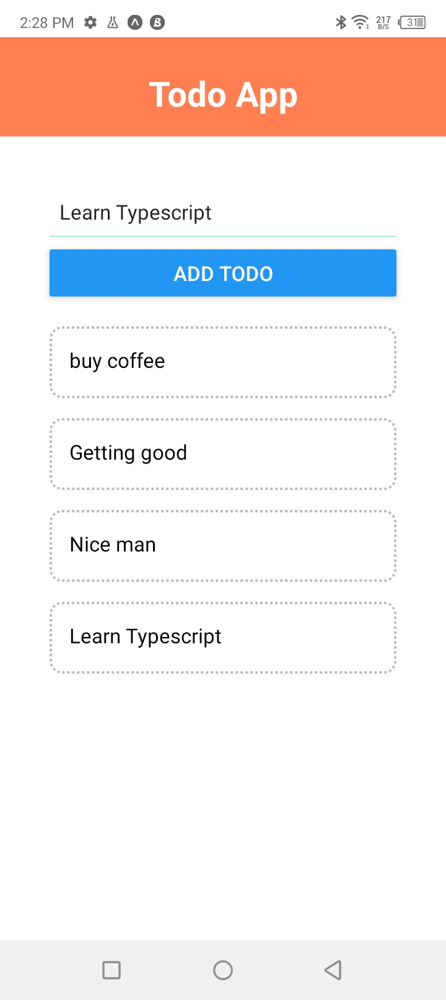

## Todo App

This is a reactNative TodoApp, where you can add the list of your todaos and delete your todos. started learning react-native to master its concepts.

## Screenshot

## Built With

- React
- React Hooks
- ReactNative
- HTML
- CSS

## Getting Started

To get a local copy up and running follow these simple example steps.

- Download expo on your mobile device or andriod emulator on your pc/desktop
- Text Editor of your choice e.g vscode
- Clone the repo by typing `git@github.com:keneogu/React-Native-TodoApp.git` on your terminal
- `npm install` to install the dependencies

## Run locally

- `yarn start` to start the project and follow the instructions on your terminal

## Author

👤 **Kenechukwu Oguagbaka**

- GitHub: [@keneogu](https://github.com/keneogu)
- Twitter: [@keneogu](https://twitter.com/keneogu)
- LinkedIn: [@keneogu](https://www.linkedin.com/in/kene-ogu/)

## 🤝 Contributing

Contributions, issues, and feature requests are welcome!
